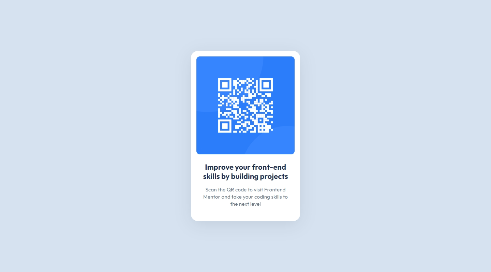
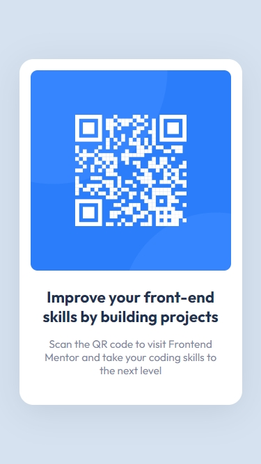

## Frontend Mentor Challenge 01 - QR Code Component

This is my solution to the [QR Code Component](https://www.frontendmentor.io/challenges/qr-code-component-iux_sIO_H) challenge on [Frontend Mentor](https://www.frontendmentor.io/).

#

### Links. 🔗

- Live Site URL: https://qr-code-component-darkstarxdd.vercel.app/

#

### Screenshots of the Solution (Desktop & Mobile). 🔍

#

### Built with. 🔨

- HTML & CSS.

#

### New Things Learned. 🎓

- About landmark elements and semantic HTML.
- Writting descriptive image alt text.
- Avoiding fixed widths & heights on containers and using `max-width` instead of `width`.

#

### Testing and Accessibility. 🧪

- Used the Responsively App to check the site's appearance on various screen sizes, from 320x480 to 3000x2000.
- Set the browser font size on desktop to various values ranging from 9px to 72px to make sure everything on the site scales properly with the user's preferred browser font size.
- Zoomed the page in and out using Ctrl + Scroll wheel (up to 500%).
- Tested with the NVDA screen reader.
- Viewed the site on an iPhone 11 in both portrait and landscape modes.
- Performed Lighthouse and PageSpeed tests. ([PageSpeed Result.](https://pagespeed.web.dev/analysis/https-qr-code-component-darkstarxdd-vercel-app/ogb9j52u0x?form_factor=mobile))

#

- Some Tools I Use - [DarkstarXDD/tools](https://gist.github.com/DarkstarXDD/4b1844eda12f34b667a0c36e05fcbdf9)

- My Frontend Mentor Profile - [@DarkstarXDD](https://www.frontendmentor.io/profile/DarkstarXDD)
